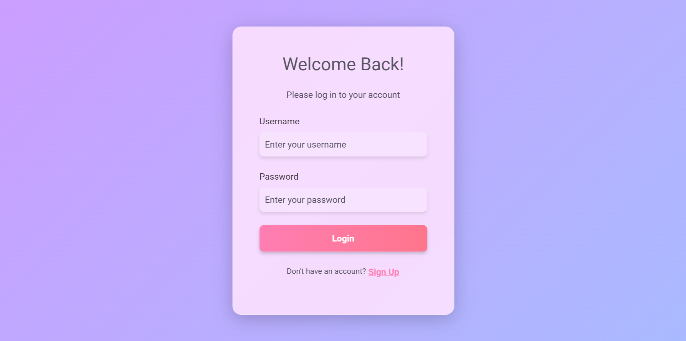
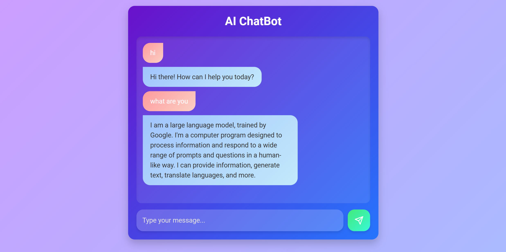

# Chatbot Application with Flask, Vue.js, and MongoDB

## Project Overview
This project is a chatbot application with the following features:
- **Backend**: Built using Flask, providing API endpoints for chatbot interaction and user authentication, integrated with MongoDB for data persistence.
- **Frontend**: Built with Vue.js, offering a clean and aesthetic interface for users to interact with the chatbot and manage authentication.
- **Authentication System**: Includes signup and login pages on both the frontend and backend.
- **Chatbot Integration**: Uses Gemini API for enhanced chatbot capabilities.

---

## Prerequisites
- Python 3.12
- Node.js 20.16
- npm 10.8
- MongoDB 7.0.12 (installed and running)

---

## Features

### Backend (Flask):
- Provides secure API endpoints for:
  - User signup
  - User login
  - Chatbot interaction
- Authentication using JSON Web Tokens (JWT).
- Data persistence with MongoDB.
- Integration with Gemini API for chatbot functionality.

### Frontend (Vue.js):
- Responsive and visually appealing interface.
- Routes:
  - `/login`: Login page.
  - `/signup`: Signup page.
  - `/chat`: Chat page where users can interact with the chatbot.
- Components:
  - `LoginPage.vue`: Handles user login.
  - `SignupPage.vue`: Handles user signup.
  - `ChatPage.vue`: Displays the chatbot interface and handles communication with the backend.

---

## Setup Instructions

### Backend Setup
1. Navigate to the `backend` directory:
   ```bash
   cd backend
   ```
2. Create and activate a virtual environment:
   ```bash
   python -m venv venv
   source venv/bin/activate   # On Windows: venv\Scripts\activate
   ```
3. Install dependencies:
   ```bash
   pip install -r requirements.txt
   ```
4. Set up MongoDB:
   - Ensure MongoDB is installed and running.

5. **Set up the Gemini API key**:
   - Create a `.env` file in the `backend` directory if it doesn't already exist.
   - Add the following line to the `.env` file, replacing `your_api_key_here` with your own Gemini API key:
     ```
     GEMINI_API_KEY=your_api_key_here
     ```
   - Make sure to install the `python-dotenv` package to load the environment variables:
     ```bash
     pip install python-dotenv
     ```

6. Run the Flask server:
   ```bash
   flask run
   ```
   The backend will be available at `http://127.0.0.1:5000/`.

### Frontend Setup
1. Navigate to the `frontend` directory:
   ```bash
   cd frontend
   ```
2. Install dependencies:
   ```bash
   npm install
   ```
3. Run the Vue.js development server:
   ```bash
   npm run dev
   ```
   The frontend will be available at `http://localhost:5173/`.

---

## Usage

1. Navigate to the signup page (`/signup`) to create a new account.
2. Log in using the `/login` route.
3. Access the chatbot interface at `/chat` after logging in.
4. Interact with the chatbot, which communicates with the Flask backend via API and uses the Gemini API for responses.

## Screenshots

<div style="display: flex; gap: 20px;">
    
    
    
</div>

---

## License
This project is licensed under the MIT License.

